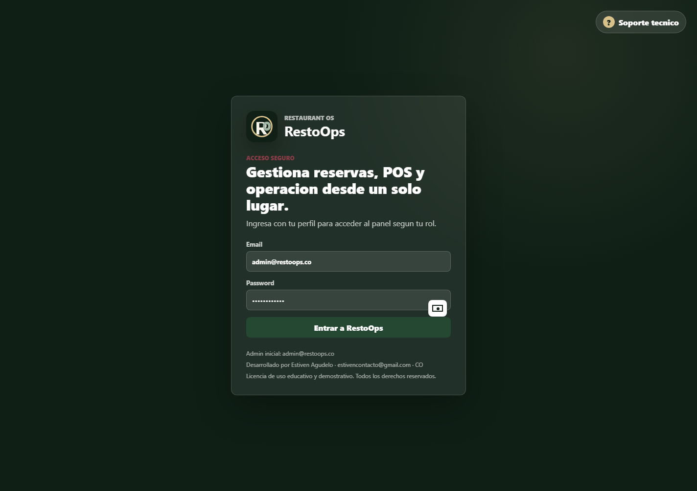
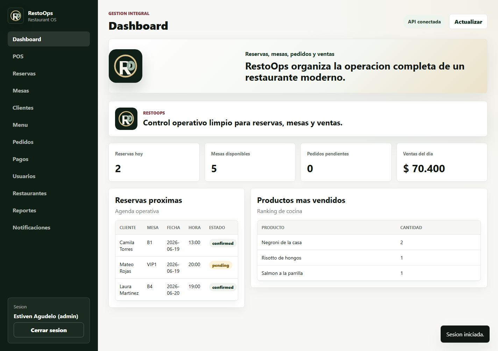
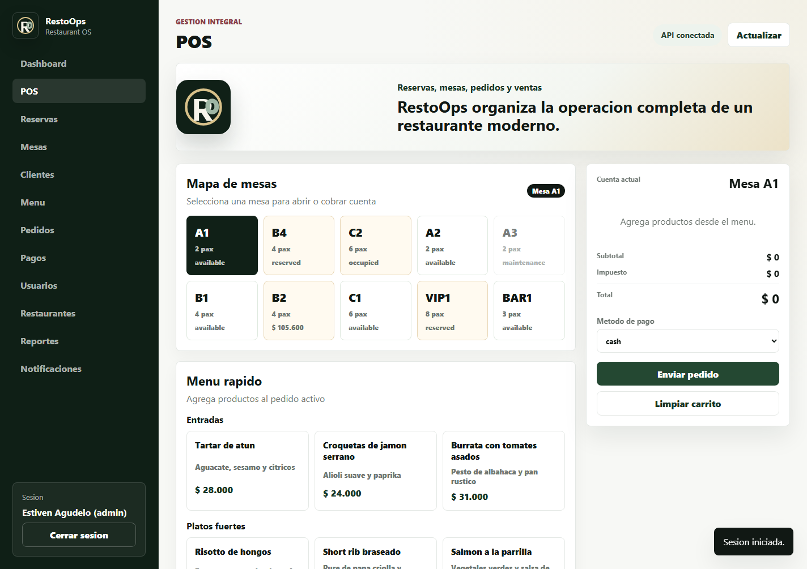
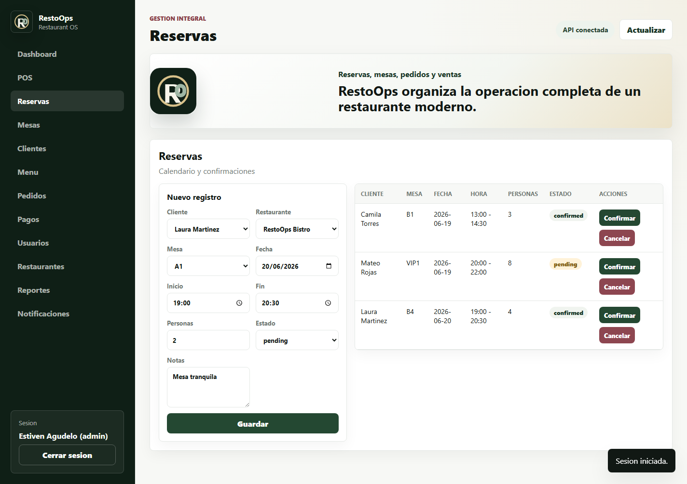
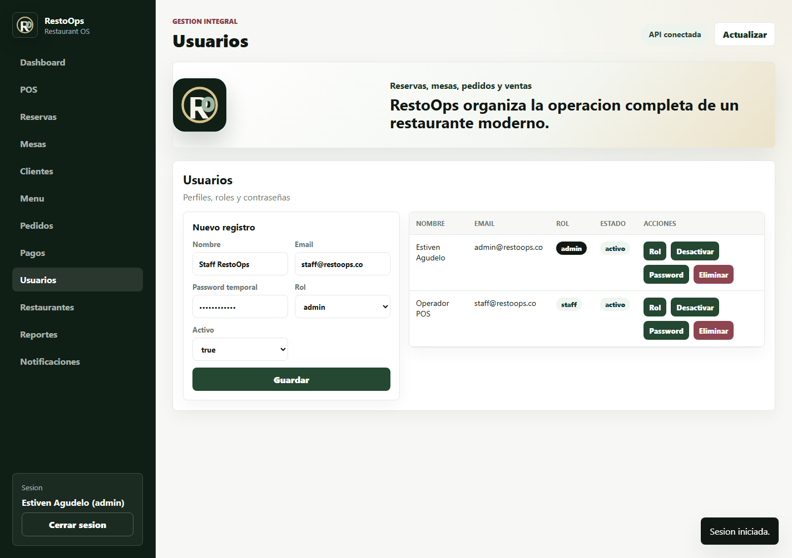

# RestoOps

RestoOps es un sistema web para la operacion integral de un restaurante. Permite administrar reservas, mesas, clientes, menu, pedidos, pagos, usuarios, reportes y un modulo POS desde una interfaz moderna conectada a una API REST con FastAPI.

El proyecto fue construido como una aplicacion completa de portafolio backend/frontend, usando Python, FastAPI, SQLAlchemy, JWT, SQLite/PostgreSQL, Docker y una interfaz web servida desde la misma API.

## Demo Visual

### Pantalla de login

Acceso inicial con autenticacion JWT, soporte tecnico por WhatsApp, logo de RestoOps y datos legales del software.



### Dashboard operativo

Vista principal con resumen de ventas, mesas disponibles, reservas del dia y productos mas vendidos.



### POS

Modulo POS para seleccionar mesas, agregar productos al carrito, enviar pedidos a cocina y cobrar cuentas.



### Reservas

Gestion de reservas con cliente, restaurante, mesa, fecha, hora, cantidad de personas, estado y notas.



### Usuarios y roles

Panel administrativo para crear usuarios, cambiar roles, activar/desactivar perfiles y resetear contrasenas.



## Funcionalidades

- Login real con JWT.
- Roles `admin`, `staff` y `customer`.
- Administracion de usuarios y contrasenas desde perfil administrador.
- Gestion de restaurantes, horarios y sedes.
- Gestion de mesas con estados: disponible, reservada, ocupada y mantenimiento.
- Registro de clientes.
- Creacion, confirmacion y cancelacion de reservas.
- Menu con categorias, precios y disponibilidad.
- POS para pedidos por mesa.
- Calculo automatico de subtotal, impuestos y total.
- Pagos por efectivo, tarjeta, debito o transferencia.
- Reportes operativos.
- Notificaciones simuladas.
- Interfaz web responsive, minimalista y elegante.
- Soporte tecnico enlazado a WhatsApp.
- Base local SQLite para desarrollo rapido.
- Compatibilidad con PostgreSQL y Docker.

## Tecnologias

- Python 3.12
- FastAPI
- SQLAlchemy 2
- Alembic
- Pydantic 2
- JWT con `python-jose`
- Passlib y bcrypt
- SQLite para desarrollo local
- PostgreSQL para despliegues con Docker
- Pandas y OpenPyXL para reportes Excel
- Pytest
- HTML, CSS y JavaScript nativo
- Docker y Docker Compose

## Estructura del proyecto

```text
restoops/
  app/
    main.py
    core/
      config.py
      exceptions.py
      security.py
    database/
      connection.py
      models.py
    modules/
      auth/
      users/
      restaurants/
      tables/
      customers/
      reservations/
      menu/
      orders/
      payments/
      reports/
      notifications/
      dashboard/
    static/
      index.html
      styles.css
      app.js
      restoops-logo.svg
  alembic/
  docs/
    images/
  scripts/
    capture_demo.py
  tests/
  Dockerfile
  docker-compose.yml
  requirements.txt
  README.md
```

## Como ejecutar en Windows

Desde PowerShell, dentro de la carpeta del proyecto:

```powershell
python -m venv .venv
.\.venv\Scripts\Activate.ps1
pip install -r requirements.txt
Copy-Item .env.example .env
```

Para usar SQLite local, deja en `.env`:

```env
DATABASE_URL=sqlite:///./restoops.db
SECRET_KEY=change-this-secret-key
ACCESS_TOKEN_EXPIRE_MINUTES=60
APP_NAME=RestoOps
ENVIRONMENT=development
DEFAULT_ADMIN_NAME=Estiven Agudelo
DEFAULT_ADMIN_EMAIL=admin@restoops.co
DEFAULT_ADMIN_PASSWORD=RestoOps2026
```

Ejecuta la API:

```powershell
.\.venv\Scripts\python.exe -m uvicorn app.main:app --host 127.0.0.1 --port 8000
```

Abre en el navegador:

```text
http://127.0.0.1:8000
```

## Credenciales iniciales

Administrador:

```text
Email: admin@restoops.co
Password: RestoOps2026
Rol: admin
```

Staff:

```text
Email: staff@restoops.co
Password: RestoOps2026
Rol: staff
```

El administrador puede crear mas usuarios desde la seccion **Usuarios**.

## Como ejecutar con Docker

Primero copia el archivo de entorno:

```bash
cp .env.example .env
```

Luego ejecuta:

```bash
docker compose up --build
```

Servicios disponibles:

```text
Aplicacion: http://localhost:8000
Swagger:    http://localhost:8000/docs
Base de datos PostgreSQL: localhost:5432
```

## API y documentacion interactiva

FastAPI genera documentacion automatica:

```text
http://127.0.0.1:8000/docs
http://127.0.0.1:8000/redoc
```

Endpoints principales:

```text
POST   /auth/login
POST   /auth/register
GET    /users/me
GET    /users
POST   /users
PUT    /users/{user_id}
DELETE /users/{user_id}
GET    /restaurants
POST   /restaurants
GET    /tables
POST   /tables
GET    /customers
POST   /customers
GET    /reservations
POST   /reservations
PATCH  /reservations/{reservation_id}/confirm
PATCH  /reservations/{reservation_id}/cancel
GET    /menu/items
POST   /menu/items
GET    /orders
POST   /orders
PATCH  /orders/{order_id}/status
GET    /payments
POST   /payments
GET    /dashboard/summary
GET    /reports/reservations/excel
GET    /reports/orders/excel
GET    /reports/sales/excel
```

## Roles del sistema

### Admin

Acceso completo al sistema. Puede administrar usuarios, restaurantes, mesas, clientes, menu, reservas, pedidos, pagos, reportes y notificaciones.

### Staff

Perfil operativo para el personal del restaurante. Puede manejar POS, reservas, mesas, clientes, pedidos, pagos, reportes y notificaciones.

### Customer

Perfil limitado para clientes. Puede acceder a reservas y menu.

## Reglas de negocio

- No se permiten mesas duplicadas dentro del mismo restaurante.
- La capacidad de una mesa debe ser mayor que cero.
- Una reserva no puede superar la capacidad de la mesa.
- Una reserva no puede estar fuera del horario de apertura.
- Una reserva no puede tener fecha pasada.
- No se permiten reservas solapadas para la misma mesa.
- Confirmar una reserva cambia la mesa a `reserved`.
- Cancelar una reserva libera la mesa.
- Los productos del menu deben tener precio mayor que cero.
- No se pueden pedir productos no disponibles.
- Los pedidos calculan subtotal, impuesto y total automaticamente.
- No se puede pagar un pedido cancelado.
- El monto del pago debe coincidir con el total del pedido.
- Confirmar un pago cambia el pedido a `paid`.
- Un administrador no puede eliminar su propio usuario.

## Flujo de uso sugerido

1. Inicia sesion con `admin@restoops.co`.
2. Revisa el Dashboard para ver el estado general.
3. Entra a **Mesas** y valida disponibilidad.
4. Entra a **Clientes** y crea o consulta clientes.
5. Entra a **Reservas** y agenda una nueva reserva.
6. Entra a **POS**, selecciona una mesa y agrega platos.
7. Envia el pedido a cocina.
8. Cobra la cuenta con el metodo de pago correspondiente.
9. Entra a **Usuarios** para crear perfiles de staff o clientes.

## Pruebas

Ejecuta:

```bash
pytest
```

Las pruebas cubren flujo de API, autenticacion, creacion de entidades principales, validaciones de reservas, pedidos y pagos.

## Capturas de demo

Las imagenes del README se generan con:

```powershell
.\.venv\Scripts\python.exe scripts\capture_demo.py
```

Antes de generar capturas, la API debe estar corriendo en:

```text
http://127.0.0.1:8000
```

## Variables de entorno

Ejemplo local:

```env
DATABASE_URL=sqlite:///./restoops.db
SECRET_KEY=change-this-secret-key
ACCESS_TOKEN_EXPIRE_MINUTES=60
POSTGRES_USER=postgres
POSTGRES_PASSWORD=postgres
POSTGRES_DB=restoops
APP_NAME=RestoOps
ENVIRONMENT=development
NOTIFICATION_PROVIDER=console
DEFAULT_ADMIN_NAME=Estiven Agudelo
DEFAULT_ADMIN_EMAIL=admin@restoops.co
DEFAULT_ADMIN_PASSWORD=RestoOps2026
```

## Licencia y uso

Este software se entrega como proyecto academico, demostrativo y de portafolio. Puede ser usado, estudiado y adaptado respetando la autoria original.

Desarrollado por Estiven Agudelo, estivencontacto@gmail.com, CO.

## Autor

**Estiven Agudelo**  
Email: estivencontacto@gmail.com  
GitHub: [@estivencontacto](https://github.com/estivencontacto)
